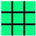
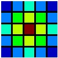
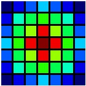
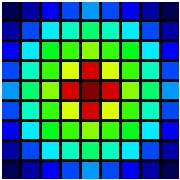
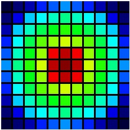

# reception_field_visualization
A visual tool for CNN feature map pixel reception field: Constructing the net by operators just like in deep-learning framewok. Then use  Visualizer to generate the reception-field image of layer you wanted. A simple example can be find in main function.

## Prerequisites
- opencv

## Operator Supported
- conv(input_, kernel=3, stride=1) : Standred Convolution Layer.
- deconv(input_, kernel=3, stride=1) : Standred Deconvolution Layer.
- dilated_conv(input_, rate=1) : Dilated Convolution Layer.

## Visualizer
- rect_size: The Pixel num of Rect in Image.
- line_width: The Width of Separator Lines.
- visual(input_): Generate Visible Images and Show.
- save(path): Save Visible Images in 'path'.
- show(): Show Visible Images.

# Visualization Result
## Convolution Layer (kernel = 3, stride = 1)
      |         |         |        |    
:-------------------------:|:-------------------------:
Layer 1 |  Layer 2 |  Layer 3 |  Layer 4 |  Layer 5

# TODO
- User-defined dilated_conv kernel size.
- Real Reception_field Size Compute API.
- Real Pixel Visual Image.(Bug fix)
